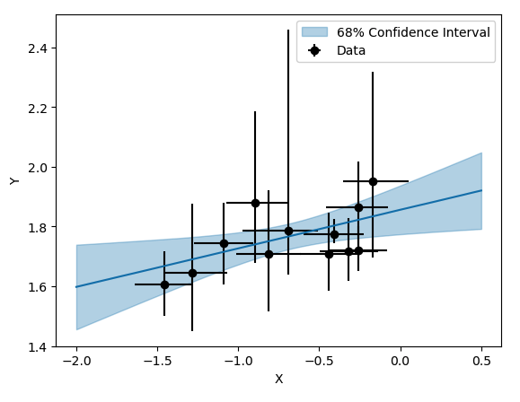
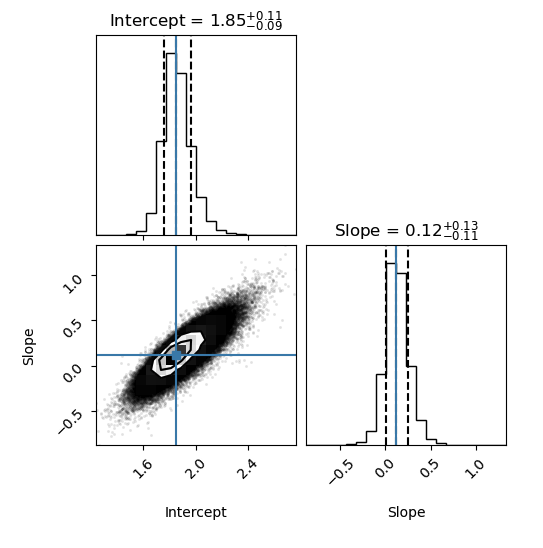

# **BALinFit: Bayesian Linear Regression with Asymmetric Errors**
**BALinFit** is a Python package for performing **MCMC-based linear regression** while handling **asymmetric uncertainties** in both x and y directions. The method uses [`emcee` documentation](https://emcee.readthedocs.io/en/stable/index.html) for MCMC sampling and applies a **Half-Gaussian sampling approach** to propagate asymmetric errors correctly.

## 🚀 Enjoy Bayesian regression with asymmetric errors! 🚀
## 🚧 Under heavy construction 🚧 




---

## **📥 Installation**

You can install **BALinFit** directly from GitHub:

### 🔹 Option 1: Install via `pip` (Recommended)**
```bash
pip install git+https://github.com/alessandropeca/BALinFit.git
```

### 🔹 Option 2: Clone and Install Locally
```bash
git clone https://github.com/alessandropeca/BALinFit.git
cd BALinFit
pip install .
```

### 📚 Python libraries needed: pandas, numpy, matplotlib, emcee, corner, scipy, tqdm

---
## Usage Example: see the python notebook


